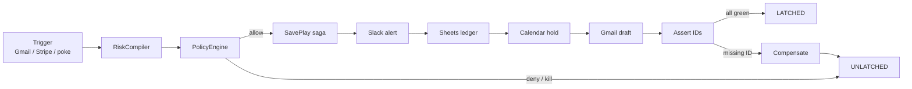
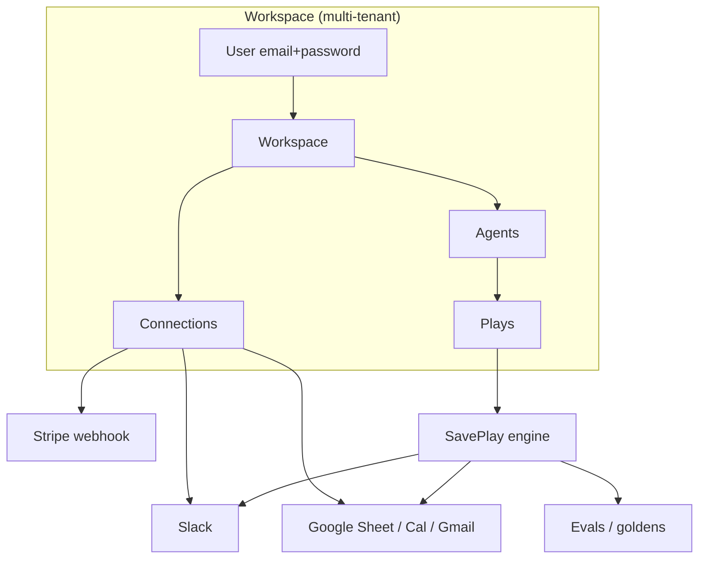
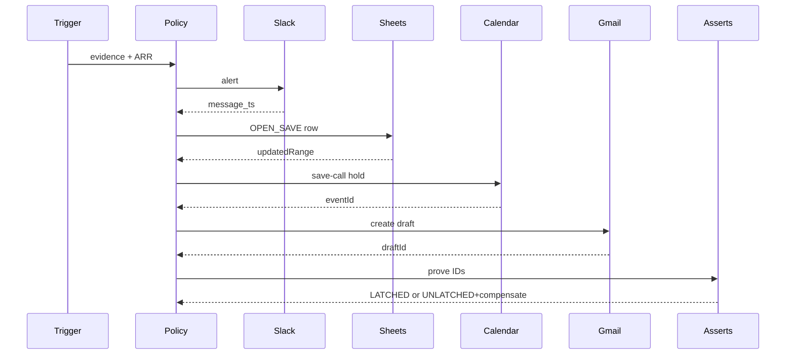

# LATCH

<p align="center">
  
</p>

<p align="center">
  <a href="https://latch.tryopal.asia"></a>
  <a href="https://latch.tryopal.asia/api/health"></a>
  <a href="https://latch.tryopal.asia/diagrams"></a>
  <a href="./memory/CREDENTIALS_RUNBOOK.md"></a>
</p>

<p align="center">
  
  
  
  
  
  <a href="https://github.com/excalidraw/excalidraw"></a>
  <a href="https://github.com/excalidraw/mermaid-to-excalidraw"></a>
</p>

**Production:** https://latch.tryopal.asia · **App:** https://latch.tryopal.asia/app · **Diagrams:** https://latch.tryopal.asia/diagrams · **Health:** https://latch.tryopal.asia/api/health

> When a customer looks ready to churn, **LATCH** runs a fail-closed save play across Slack, Sheets, Calendar, and a Gmail **draft** — and only greens when every side-effect is proven with an ID (or compensates cleanly and goes `UNLATCHED`).

---

## What's real vs what's deferred (read before judging)

| Surface | Status | Evidence |
|---|---|---|
| Marketing + multi-tenant copy | **Live** | `/` · `/how-it-works` · `/plans` |
| Email/password workspaces | **Live** | `/register` · `/login` · JWT cookie session |
| App shell (agents / plays / connections / evals / settings) | **Live** | `/app/*` |
| Slack `#cs` alert step | **Configured** | `/api/health` Slack `configured: true` |
| Google Sheets / Calendar / Gmail draft | **Configured** | `/api/health` Google `oauth+sheet present` |
| Stripe test webhook trigger | **Configured** | `STRIPE_*` on Vercel · endpoint `/api/public/stripe-webhook` |
| AgentRouter LLM (draft assist) | **Configured** | Tor on Cursor Cloud; fail-closed if unreachable |
| Live `LATCH_MODE=live` side-effects | **Gated** | Stays `dry_run` until owner flips mode |
| SMTP email verify | **Deferred** | Settings paste-token until SMTP |
| Durable multi-region store | **Not claimed** | Memory + `/tmp` on Vercel — residual risk documented |
| “Unhackable” | **Never claimed** | See [`memory/FACT_CHECK.md`](./memory/FACT_CHECK.md) |

---

## Why this shape

Peers ship chat wrappers that *say* they saved a customer.

**LATCH deletion test:** wipe the proof IDs → you no longer know whether Slack posted, Sheets wrote, Calendar held, or Gmail drafted. That shared proof trail **is** the product.

| Judging lens | LATCH |
|---|---|
| Reliability | Saga + compensation · goldens G1–G4 · force-fail eval |
| Multi-app | Slack · Sheets · Calendar · Gmail draft · Stripe trigger |
| Honesty | Draft-only Gmail · no silent greens · deferred SMTP called out |
| Multi-tenant | Workspaces + agents · email/password (Google OAuth is operator connectors only) |

---

## Architecture

<p align="center">
  
</p>







Interactive Excalidraw scenes (committed `.excalidraw` + live Mermaid → Excalidraw via [`@excalidraw/mermaid-to-excalidraw`](https://github.com/excalidraw/mermaid-to-excalidraw)):

- **Viewer:** https://latch.tryopal.asia/diagrams
- **Sources:** [`docs/diagrams/`](./docs/diagrams/) · rebuild with `npm run diagrams:build`

```
Triggers → RiskCompiler → PolicyEngine → SavePlay Saga
   → Slack ∥ Sheets → Calendar → Gmail draft
   → EvalRunner → LATCHED n/n or UNLATCHED + compensate
```

---

## External apps

| App | Role | Status |
| --- | --- | --- |
| Gmail | Trigger + draft-only save email | Configured when Google OAuth present |
| Stripe | Trigger (test webhooks) + ARR-at-risk | Configured when `STRIPE_SECRET_KEY` + `STRIPE_WEBHOOK_SECRET` set |
| Slack | `#cs` alert with run id + proof `ts` | Configured when bot token + channel set |
| Google Sheets | Risk ledger `OPEN_SAVE` / `FAILED_SAVE` | Configured when sheet ID + OAuth set |
| Google Calendar | Save-call hold | Configured when OAuth set |
| Eval board | Goldens + inject-fail | Always (in-process) |

---

## Quickstart

```sh
cp .env.example .env
# Fill keys per memory/CREDENTIALS_RUNBOOK.md (Slack, Google, Stripe)
npm install
npm run diagrams:build   # Mermaid sources → .excalidraw + public/diagrams
npm run dev
```

Open http://127.0.0.1:3000 · diagrams at `/diagrams` · health at `/api/health`.

### Stripe webhook (test mode)

Point Stripe test destination to:

`https://latch.tryopal.asia/api/public/stripe-webhook`

Events: `customer.subscription.deleted`, `invoice.payment_failed`, `customer.subscription.updated`.

### AgentRouter (Cursor Cloud)

- Base URL `https://agentrouter.org/v1` + Anthropic `POST /messages` (Tor on Cursor Cloud).
- Set `AGENT_ROUTER_HTTP_PROXY=socks5h://127.0.0.1:9050` on Cursor Cloud only — **not** on Vercel.
- Smoke: `npm run smoke:agentrouter` → ok JSON (never prints the key).

---

## How we tested reliability

| ID | Suite | Expected |
| --- | --- | --- |
| G1 | Fixture cancel → full latch | `LATCHED` + asserts green |
| G2 | Inject Slack fail mid-saga | `UNLATCHED` + compensate |
| G3 | Replay same idempotency key | Prior play returned · no dup path |
| G4 | Mutation (force RUNNING) | Asserts cannot fully green |

```bash
npm run eval:goldens
npm run test:unit
npm run typecheck
npm run build
```

---

## Doctrine

No mocks. No silent fallbacks. Gmail is **draft only**. Not “unhackable” — residual risk (serverless `/tmp`, deferred SMTP, live mode gated) is documented in [`memory/FACT_CHECK.md`](./memory/FACT_CHECK.md).
